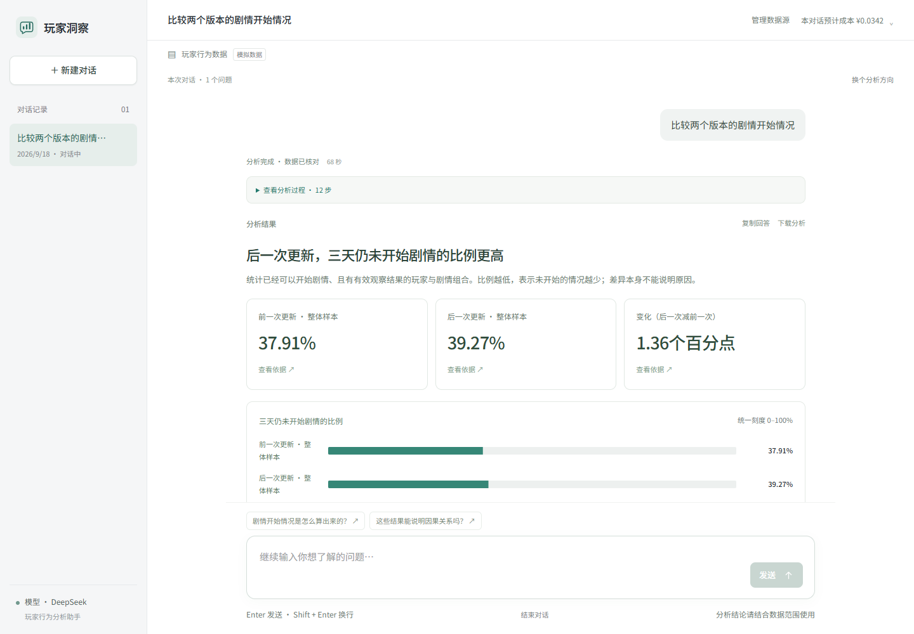
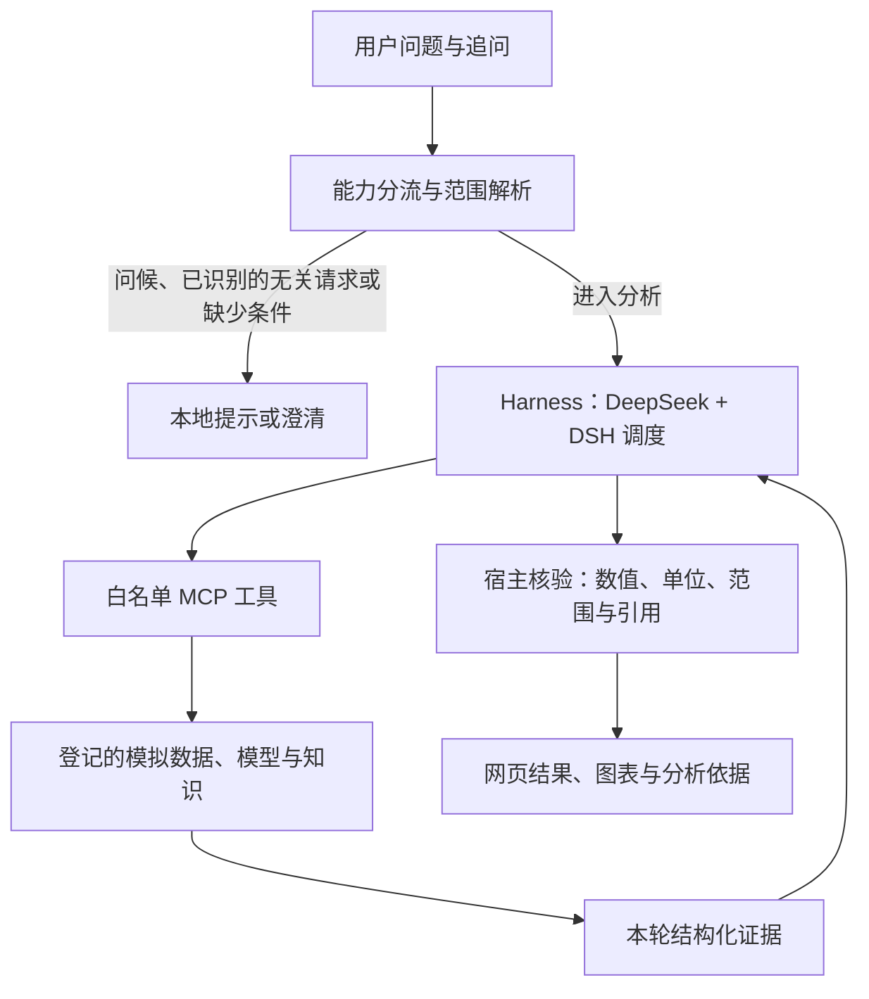

# 玩家洞察 · Game Analytics Agent

**从自然语言问题，到可核对的玩家行为分析结果。**

玩家洞察是一个面向游戏数据分析场景的中文 Agent 应用。用户可以直接提问、补充条件和追问，由 DeepSeek 理解分析意图，通过受控工具完成指标查询、版本比较、历史预测、玩家分组和玩法关联分析，并在网页中查看结果、依据、分析方法与模型用量。

项目将 **对话界面、领域分析工具和 Agent 执行控制** 串成完整链路，适合研究游戏分析助手的产品交互、工具编排和结果验证。当前分析使用固定模拟数据，日常运行默认调用真实 DeepSeek API。

[功能与示例](#功能与示例) · [快速开始](#快速开始) · [工作原理](#工作原理) · [验证状态](#验证状态) · [部署](#部署) · [文档](#文档)



*真实 Chrome / DeepSeek 本地验证截图，使用项目模拟数据；截图中的耗时与预计费用仅对应这一轮请求。*

## 功能与示例

五类方向用于帮助用户发现能力，也支持直接输入问题。是否能回答取决于已有数据、工具与分析范围；表达不明确时，助手会请求补充信息。

| 分析方向 | 可以这样问 | 返回内容 |
| --- | --- | --- |
| 版本对比 | 比较两个版本的剧情开始情况 | 统计范围、分子分母、比例、百分点差与对比图 |
| 参与预测 | 查看示例数据中的剧情参与预测 | 历史样本的预测汇总、覆盖情况与解释 |
| 玩家分组 | 不同玩家的游戏习惯有什么区别？ | 已有玩家组的规模与行为特征 |
| 玩法关联 | 玩休闲小游戏的玩家，也会玩协作玩法吗？ | 已登记玩法组合的共现计数、支持度、置信度与提升度 |
| 指标说明 | 剧情开始情况是怎么算出来的？ | 指标定义、计算口径、适用范围与资料引用 |

除分析结果外，工作台还提供：

- **连续对话与范围澄清**：支持围绕已有分析追问，展示实际采用的版本、区域或样本范围。
- **分层结果与证据**：先看摘要、数字和图表，再展开来源、完整回答与分析方法；支持复制和 Markdown 导出。
- **执行反馈与取消**：展示准备、模型请求、工具执行和核验事件，区分澄清、部分完成、失败与中断。
- **历史与用量**：保存对话，可实际删除；按问题和对话展示已回执的 token 用量、预计费用及未结算预留。
- **表格预览**：在浏览器中选择 CSV、Excel 或文件夹，预览并手动对应字段。**当前仅保存字段配置，尚不切换分析数据源。**

## 快速开始

本地已验证环境为 **Windows x64、Python 3.14、Node.js 24**；Node.js 最低版本为 22.12。以下命令均在仓库根目录的 PowerShell 中执行。

### 1. 准备分析资产

源码和分析资产分别管理。运行前需要与当前发布清单匹配的完整 `assets/`，其中包括模拟数据、统计模型和规则文件；只克隆 GitHub 源码还不能执行分析。

已有完整 `assets/` 可直接继续。资产包获取、目录结构与恢复方法见 [本地开发指南](docs/LOCAL_DEVELOPMENT.md#分析资产)。Vercel 使用同一套资产，上传方式见 [部署指南](docs/VERCEL_DEPLOYMENT.md)。

### 2. 安装依赖并构建网页

核心分析程序与 DSH 使用两个 Python 环境，以保留各自锁定的依赖版本。

```powershell
py -3.14 -m venv .venv-core
py -3.14 -m venv .venv-dsh
.\.venv-core\Scripts\python.exe -m pip install -r requirements-core.lock
.\.venv-dsh\Scripts\python.exe -m pip install -r requirements-dsh.lock

npm.cmd --prefix web ci
npm.cmd --prefix web run build
powershell -NoProfile -ExecutionPolicy Bypass -File .\scripts\check-web.ps1
.\.venv-core\Scripts\python.exe -B -m product_core verify
```

### 3. 配置 DeepSeek

首次使用时，将 `.env.example` 复制为根目录的 `.env`，填写自己的密钥。已有 `.env` 时保留原文件。

```dotenv
DEEPSEEK_API_KEY=your_deepseek_api_key
```

密钥只供后台读取。`.env` 已被 Git 忽略，不应进入提交、前端构建或分享的压缩包。真实分析可能产生 API 费用；网页金额是根据用量回执和程序单价计算的估算，不是供应商账单。

### 4. 启动

```powershell
powershell -NoProfile -ExecutionPolicy Bypass -File .\scripts\start-web.ps1
```

浏览器打开 **[http://127.0.0.1:8765/](http://127.0.0.1:8765/)**，输入“比较两个版本的剧情开始情况”开始分析。

以后只需运行启动命令，不必重新填写密钥。修改 `.env` 后重启生效。停止服务可按 **Ctrl+C**，或在另一个终端运行：

```powershell
powershell -NoProfile -ExecutionPolicy Bypass -File .\scripts\stop-web.ps1
```

需要无需密钥的开发验证时，可显式启动独立离线服务：

```powershell
powershell -NoProfile -ExecutionPolicy Bypass -File .\scripts\start-web.ps1 -Mode offline -Period offline-dev -Port 8766
```

离线地址为 **[http://127.0.0.1:8766/](http://127.0.0.1:8766/)**。离线模式使用本地模型桩和真实分析工具，适合预设场景与接口验证；自然语言理解能力不等同于真实模型。正常服务不会因 API 调用失败而自动切换到离线模式。

## 工作原理

DeepSeek 负责理解问题和组织工具调用，分析工具负责计算与检索，宿主程序负责检查范围、证据和执行约束。



### Harness 体现在哪里

本项目的 Harness 由 DSH 集成与自建控制层共同组成，具体包括：

| 责任 | 实现位置 |
| --- | --- |
| 能力分流、范围解析与追问上下文 | [web_api/capabilities.py](web_api/capabilities.py)、[请求范围核验](task13_runtime/request_scope.py) |
| DeepSeek / DSH 会话与工具循环 | [task13_runtime/host.py](task13_runtime/host.py)、[dsh_driver.py](task13_runtime/dsh_driver.py) |
| 工具入口与资源权限 | [MCP 入口](task13_runtime/mcp_entry.py)、[工具注册表](analysis_tools/registry.py) |
| 本轮证据、数值和引用检查 | [回答核验](task13_runtime/answers.py)、[证据索引](agent_runtime/claims.py) |
| 调用次数、费用预留与结算 | [预算协调器](product_core/budget.py)、[云端持久账本](cloud_api/budget.py) |
| 会话生命周期与进程回收 | [product_core/session.py](product_core/session.py)、[进程管理](agent_runtime/processes.py) |

模型只能使用登记工具和资源。常见问候及已识别的无关问题在本地返回提示；不能保证所有无关表达都零 token 拦截。分析回答需通过宿主核验，未通过的内容不会作为成功分析展示。默认关闭模型 HTTP 自动重试；有限的回答纠正仍计入原轮次预算与时限。

### 分析方法

| 能力 | 当前实际方法 | 使用边界 |
| --- | --- | --- |
| 剧情开始情况 | 指标统计与版本差异比较 | 统计取得资格后 72 小时仍未开始的比例，观察差异不等于解释原因 |
| 参与预测 | 已冻结的逻辑回归 `lr_c0p1` | 重放已登记历史样本，估计 72 小时未开始的概率，不在线训练 |
| 玩家分组 | K-means，固定三组 | 使用已有标准化参数和中心进行分配，展示已有快照统计 |
| 玩法关联 | 已登记的 Apriori 规则及计数复核 | 固定周内的共现关系，不代表先后顺序、因果或推荐收益 |
| 指标与知识说明 | 公开知识卡片的 BM25 检索 | 基于登记资料检索和引用，不搜索互联网 |

仓库中的决策树是历史候选模型，用于模型比较，**不是当前预测器**。方法说明与本轮证据绑定，详见 [分析方法说明](docs/analysis-methods.md)。

<details>
<summary>查看十个分析工具</summary>

| 工具 | 用途 |
| --- | --- |
| `inspect_context` | 获取本轮可用数据、指标与范围 |
| `check_quality` | 检查登记数据的质量与可用性 |
| `query_metric` | 查询指标的分子、分母与比例 |
| `compare_results` | 比较已有指标结果 |
| `predict_registered` | 执行已登记模型的历史预测 |
| `read_model_card` | 查看模型说明 |
| `get_evidence` | 读取可公开的结果依据 |
| `search_knowledge` | 检索指标与分析方法资料 |
| `assign_segments` | 对登记快照分配玩家组并返回汇总 |
| `query_association_rules` | 查询已有玩法关联规则 |

</details>

## 验证状态

以下是已有验证记录的范围，**不是总体准确率或生产可用性保证**。截至 2026-09-18：

| 验证层次 | 已有结果 | 记录 |
| --- | --- | --- |
| 本地工具与交互 | 五类真实工具链，桌面/手机布局、证据、导出、历史删除与取消已验证 | [体验与验收记录](docs/UX_PHASES.md) |
| 真实 DeepSeek 基线 | 15 个案例中 11 个符合预期，发现 4 项问题 | [首轮报告](docs/LIVE_VALIDATION_2026-09-18.md) |
| 针对性真实模型回归 | 修复范围映射、引用、上下文纠正和无关请求分流；6 条回归符合预期 | [修复与回归](docs/LIVE_REPAIRS_2026-09-18.md) |
| 云端适配器的本地验证 | Windows + PGlite 下五类真实工具、持久化、访问隔离与删除检查通过 | [云端适配本地报告](docs/CLOUD_VALIDATION_2026-09-18.md) |
| Linux / Neon / Vercel | 已有版本的 Linux 自动验收通过，Neon 初始化完成，Vercel 已部署。资产归档更新后，公网分析出现子进程退出和清理失败；本地错误处理修复及五类工具回归通过，线上退出原因仍待完整日志确认 | [云端排查记录](docs/CLOUD_VALIDATION_2026-09-18.md) |

离线测试替换的是模型调用，仍执行真实 DSH/MCP 与分析代码；它验证工具和控制逻辑，不证明任意自由表达都能被正确理解。历史报告记录各自验证时的版本，早期默认模式和部署计划不代表当前状态。

## 当前边界

- **数据范围固定**：当前全部结果来自模拟数据。预测只开放已登记历史样本的汇总；不输出逐个玩家的明细。
- **文件导入尚未接通分析**：CSV / Excel 预览和字段映射已实现，数据校验、工具适配及模型兼容仍需后续工作。
- **工具权限有限**：不向模型开放通用浏览、任意 SQL、Shell 或任意 Python 执行。
- **结果仍需业务判断**：引用与数值核验有明确范围，不能替代完整语义理解、统计方法审查或因果推断。
- **执行与费用有上限**：单轮最多 6 次模型请求、12 次工具调用。取消、超时或断线可能产生未知费用预留；账本会保留预留并按保护规则暂停。
- **历史恢复不等于任务续跑**：本地重启后旧对话只读，未完成任务标为中断；云端保留已完成结果，但不自动重跑失联的付费任务。清除浏览器身份 Cookie 后，不能自动找回对应历史。

## 部署

架构为 **Vercel 承载网页与分析后台，Neon PostgreSQL 保存对话、证据和费用账本**。网页已部署；公网分析的子进程退出问题仍在排查，尚未完成端到端验收。

| 部分 | 入口 |
| --- | --- |
| React / TypeScript / Vite 网页 | [web/](web/) |
| Windows 本地 Starlette / Uvicorn 服务 | [web_api/](web_api/) |
| Vercel ASGI 入口与请求内执行 | [api/index.py](api/index.py)、[cloud_api/](cloud_api/) |
| PostgreSQL 表结构 | [cloud_api/schema.sql](cloud_api/schema.sql) |
| 云端构建与资产校验 | [vercel.json](vercel.json)、[scripts/build_vercel.py](scripts/build_vercel.py) |
| 手动 Linux 验收 | [.github/workflows/cloud-acceptance.yml](.github/workflows/cloud-acceptance.yml) |

部署顺序为：**准备资产附件 → Linux 验收 → 初始化数据库 → 配置 Vercel → 公网实测**。完整环境变量、操作步骤和免费额度说明见 [Vercel 部署指南](docs/VERCEL_DEPLOYMENT.md)。托管额度与 DeepSeek API 费用分别计算。

## 仓库结构

```text
web/                       中文工作台、图表、证据与文件预览
web_api/                   本地 HTTP API、能力分流、任务状态与用量
cloud_api/                 云端执行、PostgreSQL 存储、访问与预算控制
api/                       Vercel 入口
product_core/              运行入口、会话、预算和发布完整性
task13_runtime/            DSH 集成、MCP 桥接、证据与回答核验
agent_runtime/             进程管理和基础运行约束
analysis_tools/            登记工具、聚合查询和资源访问
preparation/ · features/   观测数据准备与资格时点特征
metrics/ · modeling/       指标定义、历史模型与预测实现
segmentation/              玩家分群模型与快照
association/               玩法关联规则与计数
knowledge_core/            知识检索和引用验证
business_configs/          业务口径与玩法定义
knowledge_sources/         公开知识来源
scripts/                   启动、验收、资产打包与发布脚本
docs/                      使用指南、设计说明和验证报告
assets/                    独立分发的固定分析资产（不提交 Git）
state/                     本地运行状态与验证产物（不提交 Git）
```

部分 `task*` 目录保留历史迭代名称，是现有运行链的兼容模块，不是需要依次执行的安装步骤。

## 开发与检查

完成依赖和资产准备后，可先执行以下无需付费模型的检查：

```powershell
.\.venv-core\Scripts\python.exe -B -m product_core verify
.\.venv-core\Scripts\python.exe -B scripts\check_scope_routing.py
.\.venv-core\Scripts\python.exe -B scripts\check_public_usage.py
node web\test-analysis-methods.mjs
```

完整浏览器回归应使用独立离线服务，命令见 [本地开发指南](docs/LOCAL_DEVELOPMENT.md#验证与发布校验)。

源码、文档和前端构建受发布清单校验。`vercel.json` 额外登记 JSON 内容哈希，允许空白与对象键顺序变化，所有配置值及数组顺序仍需一致；其余文件保持字节校验。开发修改后需构建受影响的前端，再显式更新发布清单与锚点；不要在启动或部署时自动重新封版来跳过校验。

## 文档

| 想了解什么 | 文档 |
| --- | --- |
| 本地安装、资产、启动参数与故障排查 | [本地开发指南](docs/LOCAL_DEVELOPMENT.md) |
| 部署环境、数据库与 Vercel 设置 | [Vercel 部署指南](docs/VERCEL_DEPLOYMENT.md) |
| 自由提问、范围澄清与部分完成 | [Agent 能力边界](docs/AGENT_SCOPE.md) |
| 预测、聚类、关联规则与方法说明 | [分析方法](docs/analysis-methods.md) |
| CSV / Excel 预览与字段对应 | [数据源说明](docs/data-source.md) |
| HTTP 接口、任务与证据结构 | [Web API](docs/web-api.md) |
| 执行状态与界面反馈 | [执行反馈](docs/execution-feedback.md) |
| 迭代决策与分阶段验收 | [体验改版记录](docs/UX_PHASES.md) |

## 许可与来源

本仓库尚未声明项目级开源许可证，许可状态以 [LICENSE_NOTICE.md](LICENSE_NOTICE.md) 为准。第三方依赖及许可元数据见 [THIRD_PARTY.json](THIRD_PARTY.json)，代码与资产来源见 [provenance.json](provenance.json) 和 [upstream_provenance.json](upstream_provenance.json)。
